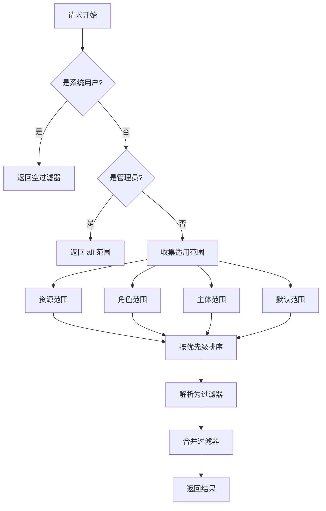

# @mtpc/data-scope

> MTPC 的行级安全控制（Row-Level Security）扩展

## 概述

`@mtpc/data-scope` 是 MTPC 框架的数据范围控制扩展，用于实现行级安全（Row-Level Security, RLS）。它与 `@mtpc/rbac`（基于角色的访问控制）互补，共同构成完整的权限控制体系：

- **RBAC**: 控制用户**能做什么**（权限/操作）
- **Data-Scope**: 控制用户**能访问哪些数据**（数据范围）

## 核心功能定位与设计目标

### 核心功能

1. **数据范围定义**: 定义灵活的数据访问范围（如：全部、租户、部门、团队、个人）
2. **范围分配**: 将范围分配给资源、角色或主体
3. **范围解析**: 在运行时根据上下文解析适用的范围
4. **过滤器生成**: 将范围转换为数据库查询过滤条件
5. **层级支持**: 支持组织结构等层级关系的数据访问控制

### 设计目标

- **业务无关**: 不依赖具体的业务模型，通过配置实现数据范围控制
- **可组合性**: 多个范围可以组合使用，支持优先级控制
- **可扩展性**: 支持自定义范围类型和条件
- **高性能**: 内置缓存机制，减少重复计算

## 模块结构与文件组织

```
src/
├── index.ts              # 包入口，导出所有公共 API
├── data-scope.ts         # DataScope 主类
├── plugin.ts             # MTPC 插件定义
├── types.ts              # 类型定义
│
├── scope/                # 范围定义模块
│   ├── index.ts
│   ├── builder.ts        # 范围构建器（流式 API）
│   ├── definition.ts     # 范围定义工具函数
│   ├── predefined.ts     # 预定义范围
│   └── registry.ts       # 范围注册表（含存储和缓存）
│
├── resolver/             # 解析器模块
│   ├── index.ts
│   ├── context-resolver.ts   # 上下文解析器
│   └── scope-resolver.ts     # 范围解析器
│
└── filter/               # 过滤器模块
    ├── index.ts
    ├── generator.ts      # 过滤器生成器
    ├── combiner.ts       # 过滤器组合器
    └── conditions.ts     # 条件预设
```

### 模块职责

| 模块 | 职责 |
|------|------|
| `scope/` | 范围的定义、验证、存储和检索 |
| `resolver/` | 解析上下文，确定哪些范围适用于当前请求 |
| `filter/` | 将范围转换为数据库查询的过滤条件 |

## 关键业务逻辑与技术实现

### 1. 范围类型系统

```typescript
export type ScopeType =
  | 'all'           // 无限制（管理员）
  | 'tenant'        // 租户隔离
  | 'department'    // 同部门
  | 'team'          // 同团队
  | 'self'          // 仅个人数据
  | 'subordinates'  // 个人及下属
  | 'custom';       // 自定义条件
```

### 2. 范围条件操作符

```typescript
export type ScopeConditionOperator =
  | 'eq'        // 等于
  | 'neq'       // 不等于
  | 'in'        // 在数组中
  | 'notIn'     // 不在数组中
  | 'contains'  // 数组包含
  | 'hierarchy'; // 层级关系（需配合 HierarchyResolver）
```

### 3. 范围解析流程



### 4. 管理员检测逻辑

管理员检测支持两种方式：

1. **角色检测**: 检查用户是否拥有指定的管理员角色（默认 `['admin']`）
2. **通配符权限**: 检查用户是否拥有 `*` 通配符权限

```typescript
// 可配置的管理员检查器
const adminChecker = createAdminChecker(
  ['admin', 'superuser'],  // 管理员角色
  true                      // 检查通配符权限
);
```

### 5. 层级解析器

用于处理组织结构等层级关系：

```typescript
interface HierarchyResolver {
  resolveRoot(rootId: string): Promise<string[]>;
}

// 示例：组织结构层级解析器
const orgHierarchyResolver: HierarchyResolver = {
  async resolveRoot(departmentId: string) {
    // 返回该部门及其所有子部门的 ID
    const descendants = await getDepartmentDescendants(departmentId);
    return [departmentId, ...descendants.map(d => d.id)];
  }
};
```

## API 接口设计与使用方式

### 主类：DataScope

```typescript
class DataScope {
  // 定义新范围
  async defineScope(definition: Omit<DataScopeDefinition, 'id'>): Promise<DataScopeDefinition>

  // 获取范围
  async getScope(id: string): Promise<DataScopeDefinition | null>

  // 分配范围到资源/角色/主体
  async assignToResource(tenantId: string, resourceName: string, scopeId: string, options?: { priority?: number }): Promise<ScopeAssignment>
  async assignToRole(tenantId: string, roleName: string, scopeId: string, options?: { priority?: number }): Promise<ScopeAssignment>
  async assignToSubject(tenantId: string, subjectId: string, scopeId: string, options?: { priority?: number }): Promise<ScopeAssignment>

  // 解析范围
  async resolve(ctx: MTPCContext, resourceName: string, action?: string, existingFilters?: FilterCondition[]): Promise<ScopeResolutionResult>

  // 获取过滤器
  async getFilters(ctx: MTPCContext, resourceName: string, existingFilters?: FilterCondition[]): Promise<FilterCondition[]>

  // 集成到 MTPC
  integrateWith(mtpc: MTPC): void

  // 快速设置
  async setupDefaultScopes(tenantId: string, roleScopes: Record<string, ScopeType>): Promise<void>
}
```

### 范围构建器：流式 API

```typescript
import { scope, createScope } from '@mtpc/data-scope';

// 方式一：使用构建器
const customScope = scope('我的部门')
  .id('scope:my-department')
  .description('只能访问本部门的数据')
  .department()
  .priority(50)
  .build();

// 方式二：使用预设
const selfScope = createScope.self('个人数据', 'createdBy');
```

### 创建 DataScope 实例

```typescript
import { createDataScope } from '@mtpc/data-scope';

const dataScope = createDataScope({
  // 存储配置
  store: new InMemoryDataScopeStore(),

  // 默认范围（当没有分配范围时使用）
  defaultScope: 'tenant',

  // 字段配置
  ownerField: 'createdBy',
  departmentField: 'departmentId',
  teamField: 'teamId',

  // 缓存配置
  cacheTTL: 60000, // 60 秒

  // 管理员配置
  adminRoles: ['admin', 'superuser'],
  checkWildcardPermission: true,

  // 层级解析器
  hierarchyResolver: orgHierarchyResolver,
});
```

## 与 core 包的依赖关系及交互机制

### 依赖关系图

```
@mtpc/core
    │
    ├── MTPCContext           # 上下文（租户、主体）
    ├── FilterCondition       # 过滤条件类型
    ├── ResourceDefinition    # 资源定义
    ├── ResourceHooks         # 资源钩子
    └── PluginDefinition      # 插件定义
         │
         ▼
@mtpc/data-scope
    │
    ├── 使用 MTPCContext 解析范围值
    ├── 生成 FilterCondition
    ├── 扩展 ResourceHooks.filterQuery
    └── 实现 PluginDefinition
```

### 交互机制

1. **通过 filterQuery 钩子集成**

```typescript
// data-scope 为每个资源注册 filterQuery 钩子
dataScope.integrateWith(mtpc);

// 当查询数据时，MTPC 会调用 filterQuery 钩子
// data-scope 返回相应的过滤条件
const filters = await dataScope.getFilters(ctx, 'User');
// 结果: [{ field: 'departmentId', operator: 'eq', value: 'dept-123' }]
```

2. **使用 @mtpc/shared 工具**

```typescript
// context-resolver.ts 中使用 shared 包的工具
import { getByPath } from '@mtpc/shared';

export function resolveFromContext(ctx: MTPCContext, path: string): unknown {
  return getByPath(ctx as unknown as Record<string, unknown>, path);
}
```

## 性能优化策略

### 1. 内置缓存机制

```typescript
class ScopeRegistry {
  private cache: Map<string, { scope: DataScopeDefinition; expiresAt: number }>;
  private cacheTTL: number;

  async getScope(id: string): Promise<DataScopeDefinition | null> {
    // 检查缓存
    const cached = this.cache.get(id);
    if (cached && cached.expiresAt > Date.now()) {
      return cached.scope;
    }

    // 从存储加载
    const scope = await this.store.getScope(id);
    if (scope) {
      this.cache.set(id, {
        scope,
        expiresAt: Date.now() + this.cacheTTL,
      });
    }

    return scope;
  }
}
```

### 2. 范围去重

```typescript
// 在 getScopesForSubject 中使用 Set 避免重复范围
const seenIds = new Set<string>();
for (const assignment of assignments) {
  if (!seenIds.has(assignment.scopeId)) {
    const scope = await this.getScope(assignment.scopeId);
    if (scope) {
      scopes.push(scope);
      seenIds.add(assignment.scopeId);
    }
  }
}
```

### 3. 优先级排序

范围按优先级降序排列，高优先级范围先被评估：

```typescript
// 预定义范围的默认优先级
SCOPE_ALL:       priority 1000 (最高)
SCOPE_TENANT:    priority 100
SCOPE_DEPARTMENT: priority 50
SCOPE_TEAM:      priority 30
SCOPE_SELF:      priority 10
```

### 4. 独占范围优化

当遇到 `combinable: false` 的范围时，直接使用该范围，跳过其他范围：

```typescript
const exclusive = sorted.find(s => !s.definition.combinable);
if (exclusive) {
  return exclusive.filters; // 直接返回，不组合其他范围
}
```

## 错误处理机制

### 1. 范围验证

```typescript
export function validateScopeDefinition(scope: DataScopeDefinition): void {
  if (!scope.id || typeof scope.id !== 'string') {
    throw new Error('Scope must have a valid ID');
  }

  if (!scope.name || typeof scope.name !== 'string') {
    throw new Error('Scope must have a valid name');
  }

  const validTypes: ScopeType[] = ['all', 'tenant', 'department', 'team', 'self', 'subordinates', 'custom'];
  if (!validTypes.includes(scope.type)) {
    throw new Error(`Invalid scope type: ${scope.type}`);
  }

  if (scope.type === 'custom' && (!scope.conditions || scope.conditions.length === 0)) {
    throw new Error('Custom scope must have at least one condition');
  }
}
```

### 2. 预定义范围保护

```typescript
async deleteScope(id: string): Promise<boolean> {
  // 防止删除预定义范围
  if (Object.values(PREDEFINED_SCOPES).some(s => s.id === id)) {
    throw new Error('Cannot delete predefined scope');
  }
  return this.scopes.delete(id);
}
```

### 3. 冲突检测

```typescript
export function hasConflict(filters: FilterCondition[]): boolean {
  // 检测 eq/neq 冲突
  for (const filter of filters) {
    const existing = fieldValues.get(filter.field);
    if (existing) {
      if (
        (existing.operator === 'eq' && filter.operator === 'neq') ||
        (existing.operator === 'neq' && filter.operator === 'eq')
      ) {
        if (existing.values.includes(filter.value)) {
          return true; // 冲突：同一字段既有 eq 又有 neq 相同值
        }
      }
    }
  }
  return false;
}
```

## 潜在技术债务与优化点

### 当前限制

1. **OR 逻辑支持不完整**
   - `combineFilters` 的 'or' 模式只是简单展平，实际 OR 逻辑需要查询层支持
   - 建议在 FilterCondition 中添加逻辑运算符（AND/OR/NOT）

2. **PluginContext 限制**
   - 插件的 `install` 方法无法访问已注册的资源列表
   - 必须手动调用 `integrateWith` 方法

3. **同步 ID 生成**
   - `InMemoryDataScopeStore` 使用自增计数器生成 ID
   - 多实例环境下可能产生 ID 冲突

4. **无分布式缓存支持**
   - 缓存是本地内存存储
   - 多实例部署时缓存不共享

### 建议优化

1. **增强过滤器逻辑**
   ```typescript
   // 建议：支持嵌套逻辑
   interface LogicalFilter {
     operator: 'and' | 'or' | 'not';
     filters: (FilterCondition | LogicalFilter)[];
   }
   ```

2. **实现分布式存储**
   ```typescript
   // 建议：添加 Redis 存储实现
   export class RedisDataScopeStore implements DataScopeStore {
     // 使用 Redis 存储范围定义和分配
   }
   ```

3. **添加范围继承**
   ```typescript
   // 建议：支持范围继承
   interface DataScopeDefinition {
     extends?: string; // 父范围 ID
   }
   ```

4. **完善审计日志**
   ```typescript
   // 建议：记录范围解析日志
   interface ScopeResolutionResult {
     scopes: ResolvedScope[];
     auditLog: {
       resolvedAt: Date;
       userId: string;
       appliedScopes: string[];
       reason: string;
     };
   }
   ```

---

## 完整使用示例

### 示例 1：基础使用

```typescript
import { createMTPC } from '@mtpc/core';
import { createDataScope, scope } from '@mtpc/data-scope';

// 1. 创建 MTPC 和 DataScope 实例
const mtpc = createMTPC();
const dataScope = createDataScope({
  defaultScope: 'tenant',
  adminRoles: ['admin'],
});

// 2. 注册资源
mtpc.registry.registerResource({
  name: 'User',
  permissions: ['user:read', 'user:create', 'user:update', 'user:delete'],
  hooks: {},
});

// 3. 集成 data-scope
dataScope.integrateWith(mtpc);

// 4. 定义自定义范围
await dataScope.defineScope({
  name: '本部门',
  description: '只能访问本部门的数据',
  type: 'department',
  conditions: [
    {
      field: 'departmentId',
      operator: 'eq',
      value: ctx => ctx.subject.metadata?.departmentId,
    },
  ],
  priority: 50,
});

// 5. 分配范围到角色
await dataScope.assignToRole('tenant-123', 'manager', 'scope:department');

// 6. 使用过滤器
const ctx: MTPCContext = {
  tenant: { id: 'tenant-123' },
  subject: {
    id: 'user-456',
    type: 'user',
    roles: ['manager'],
    metadata: { departmentId: 'dept-789' },
  },
};

const filters = await dataScope.getFilters(ctx, 'User');
// 结果: [{ field: 'tenantId', operator: 'eq', value: 'tenant-123' },
//        { field: 'departmentId', operator: 'eq', value: 'dept-789' }]
```

### 示例 2：组织层级支持

```typescript
import { createDataScope } from '@mtpc/data-scope';

// 定义层级解析器
const orgHierarchyResolver = {
  async resolveRoot(rootId: string): Promise<string[]> {
    // 模拟：从数据库获取所有子部门
    const children = await db.department.findMany({
      where: { path: { startsWith: `${rootId}.` } },
    });
    return [rootId, ...children.map(d => d.id)];
  },
};

const dataScope = createDataScope({
  hierarchyResolver: orgHierarchyResolver,
});

// 定义层级范围
await dataScope.defineScope({
  name: '部门及子部门',
  description: '可以访问本部门及所有子部门的数据',
  type: 'custom',
  conditions: [
    {
      field: 'departmentId',
      operator: 'hierarchy', // 使用层级操作符
      value: ctx => ctx.subject.metadata?.departmentId,
    },
  ],
});
```

### 示例 3：动态范围值

```typescript
// 范围值可以是静态值或解析函数
const dynamicScope = await dataScope.defineScope({
  name: '我的项目',
  type: 'custom',
  conditions: [
    {
      field: 'projectId',
      operator: 'in',
      // 函数值：运行时动态解析
      value: async (ctx) => {
        // 从数据库获取用户参与的项目
        const projects = await db.projectMember.findMany({
          where: { userId: ctx.subject.id },
        });
        return projects.map(p => p.projectId);
      },
    },
  ],
});
```

### 示例 4：快速设置默认范围

```typescript
// 为不同角色设置默认范围
await dataScope.setupDefaultScopes('tenant-123', {
  admin: 'all',          // 管理员：无限制
  manager: 'department',  // 经理：本部门
  employee: 'self',       // 员工：仅个人
});

// 等价于：
await dataScope.assignToRole('tenant-123', 'admin', 'scope:all');
await dataScope.assignToRole('tenant-123', 'manager', 'scope:department');
await dataScope.assignToRole('tenant-123', 'employee', 'scope:self');
```

### 示例 5：检查访问权限

```typescript
// 检查用户是否有无限制访问权限
const hasUnrestricted = await dataScope.hasUnrestrictedAccess(ctx);
if (hasUnrestricted) {
  // 跳过数据过滤
  return await db.user.findMany();
} else {
  // 应用数据范围过滤
  const filters = await dataScope.getFilters(ctx, 'User');
  return await db.user.findMany({ where: buildWhereClause(filters) });
}

// 获取有效的范围类型
const scopeType = await dataScope.getResolver().getEffectiveScopeType(ctx, 'User');
console.log(`用户的访问范围: ${scopeType}`); // 'department'
```

### 示例 6：范围组合

```typescript
// 定义多个可组合的范围
const tenantScope = scope('租户').tenant().build();
const departmentScope = scope('部门').department().build();
const teamScope = scope('团队').team().build();

// 分配给用户
await dataScope.assignToSubject('tenant-123', 'user-456', 'scope:tenant');
await dataScope.assignToSubject('tenant-123', 'user-456', 'scope:department');
await dataScope.assignToSubject('tenant-123', 'user-456', 'scope:team');

// 解析时，所有范围会被组合（AND 逻辑）
const result = await dataScope.resolve(ctx, 'User');
// 结果包含所有三个范围的过滤条件
```

### 示例 7：独占范围

```typescript
// 定义独占范围（不可与其他范围组合）
const adminScope = scope('管理员')
  .all()
  .exclusive() // 设置为独占
  .priority(1000)
  .build();

// 当用户拥有独占范围时，只使用该范围
await dataScope.assignToRole('tenant-123', 'admin', adminScope.id);

// 解析时，即使有其他范围，也只返回 adminScope 的过滤器
const result = await dataScope.resolve(ctx, 'User');
// 结果: [] (空过滤器，无限制)
```

## 常见问题解答

### Q1: data-scope 与 rbac 有什么区别？

**A:**
- `@mtpc/rbac`: 控制用户**能做什么操作**（如：user:read、user:create）
- `@mtpc/data-scope`: 控制用户**能访问哪些数据**（如：只看本部门的数据）

两者结合使用：
```typescript
// RBAC: 检查是否有读取权限
const canRead = await mtpc.authorize(ctx, 'user', 'read');
if (!canRead) throw new Error('无权限');

// Data-Scope: 获取数据范围过滤
const filters = await dataScope.getFilters(ctx, 'User');
const users = await db.user.findMany({ where: buildWhereClause(filters) });
```

### Q2: 如何处理复杂的 OR 逻辑？

**A:** 当前版本通过多个范围分配实现类似效果：

```typescript
// 场景：用户可以访问自己的数据 OR 本团队的数据
// 方案：为用户分配两个范围，由查询层处理 OR 逻辑

await dataScope.assignToSubject('tenant-123', 'user-456', 'scope:self');
await dataScope.assignToSubject('tenant-123', 'user-456', 'scope:team');

const result = await dataScope.resolve(ctx, 'User');
// 需要在查询层使用 OR 逻辑组合结果中的过滤器
```

### Q3: 如何在生产环境部署？

**A:**
1. 实现自定义 `DataScopeStore`（如 Redis、数据库）
2. 配置合理的 `cacheTTL`
3. 监控范围解析性能
4. 记录范围应用日志用于审计

```typescript
import { Redis } from 'ioredis';

class RedisDataScopeStore implements DataScopeStore {
  private redis: Redis;

  constructor(redis: Redis) {
    this.redis = redis;
  }

  async createScope(scope: Omit<DataScopeDefinition, 'id'>): Promise<DataScopeDefinition> {
    const id = await this.redis.incr('scope:id');
    const newScope = { ...scope, id: `scope:${id}` };
    await this.redis.hset('scopes', newScope.id, JSON.stringify(newScope));
    return newScope;
  }

  // 实现其他方法...
}

const dataScope = createDataScope({
  store: new RedisDataScopeStore(redis),
  cacheTTL: 300000, // 5 分钟
});
```

### Q4: 如何调试范围解析？

**A:** 使用 `resolve` 方法获取详细信息：

```typescript
const result = await dataScope.resolve(ctx, 'User');

console.log('应用的范围:', result.appliedScopeIds);
console.log('解析的范围:', result.scopes.map(s => ({
  id: s.definition.id,
  name: s.definition.name,
  filters: s.filters,
})));
console.log('合并后的过滤器:', result.combinedFilters);
console.log('解析时间:', result.resolvedAt);
```

### Q5: 性能优化建议？

**A:**
1. **启用缓存**: 设置合理的 `cacheTTL`
2. **减少范围数量**: 只分配必要的范围
3. **使用预定义范围**: 避免重复创建相似范围
4. **优化层级解析**: 缓存层级关系
5. **监控性能**: 记录范围解析耗时

```typescript
const dataScope = createDataScope({
  cacheTTL: 300000, // 5 分钟缓存
  hierarchyResolver: new CachedHierarchyResolver(baseResolver),
});
```

## 注意事项

1. **插件集成限制**: 由于 `PluginContext` 不提供 `listResources()` 方法，必须手动调用 `integrateWith(mtpc)`

2. **预定义范围保护**: 预定义范围（如 `scope:all`）无法被删除

3. **ID 唯一性**: 多实例部署时需确保范围 ID 唯一性

4. **线程安全**: 当前 `InMemoryDataScopeStore` 不是线程安全的，单实例使用

5. **类型安全**: 使用 TypeScript 时充分利用类型定义避免错误

## 类型参考

### DataScopeOptions

```typescript
interface DataScopeOptions {
  store?: DataScopeStore;                    // 自定义存储
  defaultScope?: ScopeType;                  // 默认范围类型
  ownerField?: string;                       // 所有者字段名
  departmentField?: string;                  // 部门字段名
  teamField?: string;                        // 团队字段名
  cacheTTL?: number;                         // 缓存 TTL（毫秒）
  adminRoles?: string[];                     // 管理员角色
  checkWildcardPermission?: boolean;         // 检查通配符权限
  hierarchyResolver?: HierarchyResolver;     // 层级解析器
}
```

### ScopeResolutionResult

```typescript
interface ScopeResolutionResult {
  scopes: ResolvedScope[];           // 解析后的范围列表
  combinedFilters: FilterCondition[]; // 合并后的过滤条件
  appliedScopeIds: string[];         // 应用的范围 ID
  resolvedAt: Date;                  // 解析时间
}
```

### ResolvedScope

```typescript
interface ResolvedScope {
  definition: DataScopeDefinition;   // 范围定义
  filters: FilterCondition[];        // 生成的过滤器
  resolvedAt: Date;                  // 解析时间
}
```

---

**更多信息**: 请参考 [MTPC 架构文档](../.claude/docs/architecture.md)
