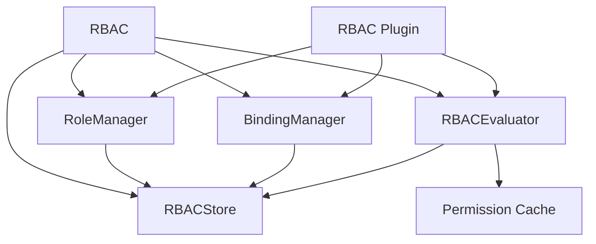
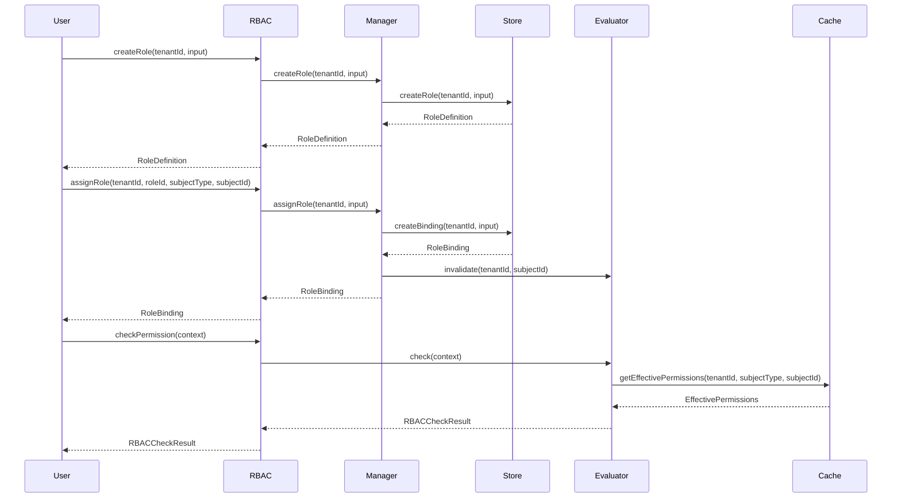

# @mtpc/rbac 深入技术分析与使用指南

## 目录

1. [概述](#1-概述)
2. [架构设计](#2-架构设计)
3. [核心类型定义](#3-核心类型定义)
4. [角色管理](#4-角色管理)
5. [角色绑定](#5-角色绑定)
6. [权限检查](#6-权限检查)
7. [缓存机制](#7-缓存机制)
8. [插件集成](#8-插件集成)
9. [存储后端](#9-存储后端)
10. [系统角色](#10-系统角色)
11. [API 接口说明](#11-api-接口说明)
12. [参数配置详解](#12-参数配置详解)
13. [使用示例代码](#13-使用示例代码)
14. [常见问题解决方案](#14-常见问题解决方案)
15. [最佳实践建议](#15-最佳实践建议)

---

## 1. 概述

### 1.1 包定位

`@mtpc/rbac` 是 MTPC (Multi-Tenant Permission Core) 的官方 RBAC (Role-Based Access Control) 扩展。根据 MTPC 架构文档，RBAC 扩展的职责仅限于：

- 定义 Role / RoleBinding 结构
- 将 Role 映射为 Permission 集合
- 将角色关系编译为 Core 可执行的 Policy

**重要**：RBAC 不是 Core 的一部分，而是 Policy 的一种具体实现。

### 1.2 核心特性

- **角色管理**：创建、更新、删除和查询角色
- **角色继承**：支持角色间的权限继承关系
- **角色绑定**：将角色分配给用户、组或服务
- **临时权限**：支持带有过期时间的权限分配
- **权限检查**：基于角色的权限验证
- **有效权限计算**：自动计算包含继承权限的有效权限集
- **权限缓存**：内置缓存机制提高性能
- **系统角色**：预定义的超级管理员、租户管理员和访客角色
- **多租户支持**：完全的租户隔离

### 1.3 设计原则

- **业务无关**：不绑定任何具体业务逻辑
- **可嵌入**：作为 npm 包引入，不依赖外部服务
- **可组合**：通过插件系统和钩子系统实现灵活扩展
- **类型安全**：完整的 TypeScript 类型支持
- **默认拒绝**：遵循安全最佳实践，默认拒绝所有访问

---

## 2. 架构设计

### 2.1 模块结构

```
packages/rbac/src/
├── types.ts              # 类型定义
├── rbac.ts               # RBAC 主类
├── plugin.ts             # MTPC 插件集成
├── role/                 # 角色管理
│   ├── manager.ts        # 角色管理器
│   ├── builder.ts        # 角色构建器
│   ├── validator.ts      # 输入验证
│   └── index.ts
├── binding/              # 角色绑定
│   ├── manager.ts        # 绑定管理器
│   ├── validator.ts      # 输入验证
│   └── index.ts
├── policy/               # 权限评估
│   ├── evaluator.ts      # 权限评估器
│   ├── compiler.ts       # 策略编译器
│   └── index.ts
└── store/                # 存储后端
    ├── memory-store.ts   # 内存存储实现
    └── index.ts
```

### 2.2 核心组件关系



### 2.3 数据流



---

## 3. 核心类型定义

### 3.1 角色状态与类型

```typescript
/**
 * 角色状态
 * - active: 角色处于活动状态
 * - inactive: 角色被停用
 * - archived: 角色已归档
 */
type RoleStatus = 'active' | 'inactive' | 'archived';

/**
 * 角色类型
 * - system: 系统预定义角色，不可修改和删除
 * - custom: 用户自定义角色
 * - template: 角色模板
 */
type RoleType = 'system' | 'custom' | 'template';
```

### 3.2 角色定义

```typescript
interface RoleDefinition {
  id: string;                    // 角色唯一标识符
  tenantId: string;              // 所属租户 ID
  name: string;                  // 角色名称（唯一）
  displayName?: string;           // 角色显示名称
  description?: string;           // 角色描述
  type: RoleType;                // 角色类型
  status: RoleStatus;             // 角色状态
  permissions: string[];         // 权限列表
  inherits?: string[];            // 继承的角色 ID 列表
  metadata?: Record<string, unknown>;  // 自定义元数据
  createdAt: Date;               // 创建时间
  updatedAt: Date;               // 更新时间
  createdBy?: string;            // 创建者 ID
}
```

### 3.3 角色绑定

```typescript
/**
 * 主体类型
 * - user: 用户
 * - group: 用户组
 * - service: 服务
 */
type BindingSubjectType = 'user' | 'group' | 'service';

interface RoleBinding {
  id: string;                    // 绑定唯一标识符
  tenantId: string;              // 所属租户 ID
  roleId: string;                // 绑定的角色 ID
  subjectType: BindingSubjectType;  // 主体类型
  subjectId: string;             // 主体 ID
  expiresAt?: Date;              // 过期时间（未设置表示永久有效）
  metadata?: Record<string, unknown>;  // 自定义元数据
  createdAt: Date;               // 创建时间
  createdBy?: string;            // 创建者 ID
}
```

### 3.4 权限检查结果

```typescript
interface RBACCheckResult {
  allowed: boolean;               // 是否允许访问
  matchedRoles: string[];         // 授予该权限的所有角色 ID
  reason?: string;                // 人类可读的检查结果说明
}
```

### 3.5 有效权限

```typescript
interface EffectivePermissions {
  tenantId: string;              // 所属租户 ID
  subjectId: string;             // 主体 ID
  subjectType: BindingSubjectType;  // 主体类型
  roles: string[];               // 权限来源角色 ID 列表
  permissions: Set<string>;      // 有效权限集合
  computedAt: Date;              // 计算时间
  expiresAt?: Date;              // 缓存过期时间
}
```

---

## 4. 角色管理

### 4.1 创建角色

```typescript
import { createRBAC } from '@mtpc/rbac';

const rbac = createRBAC();

// 方式 1：使用 createRole 方法
const role = await rbac.createRole('tenant-001', {
  name: 'editor',
  displayName: 'Content Editor',
  description: 'Can edit and publish content',
  type: 'custom',
  status: 'active',
  permissions: ['content:read', 'content:write'],
  inherits: ['viewer'],
  metadata: { category: 'editorial' }
}, 'admin');

console.log(role.id);           // 自动生成的 ID
console.log(role.createdAt);     // 自动设置的时间戳
```

### 4.2 使用 RoleBuilder

```typescript
import { role } from '@mtpc/rbac';

// 方式 2：使用 RoleBuilder 流式 API
const input = role('editor')
  .displayName('Content Editor')
  .description('Can edit and publish content')
  .system()  // 或 .custom() / .template()
  .permissions('content:read', 'content:write')
  .inherit('viewer')
  .metadata({ category: 'editorial' })
  .build();

const role = await rbac.createRole('tenant-001', input);
```

### 4.3 角色继承

```typescript
// 创建基础角色
const viewer = await rbac.createRole('tenant-001', {
  name: 'viewer',
  displayName: 'Viewer',
  permissions: ['content:read']
});

// 创建继承 viewer 的 editor 角色
const editor = await rbac.createRole('tenant-001', {
  name: 'editor',
  displayName: 'Editor',
  permissions: ['content:write'],
  inherits: ['viewer']  // 继承 viewer 的权限
});

// 创建继承 editor 的 admin 角色
const admin = await rbac.createRole('tenant-001', {
  name: 'admin',
  displayName: 'Administrator',
  permissions: ['content:delete'],
  inherits: ['editor']  // 间接继承 viewer
});

// admin 将拥有所有权限：content:read, content:write, content:delete
```

### 4.4 更新角色

```typescript
const updated = await rbac.updateRole('tenant-001', 'role-id', {
  displayName: 'Senior Editor',
  status: 'active',
  permissions: ['content:read', 'content:write', 'content:publish'],
  inherits: ['viewer', 'reviewer']  // 完全替换继承关系
});

// 注意：系统角色不能被修改
```

### 4.5 删除角色

```typescript
const deleted = await rbac.deleteRole('tenant-001', 'role-id');
if (deleted) {
  console.log('角色已删除');
}

// 注意：
// 1. 系统角色不能被删除
// 2. 删除角色会自动删除所有相关绑定
```

### 4.6 查询角色

```typescript
// 根据 ID 获取角色
const role = await rbac.getRole('tenant-001', 'role-id');

// 列出所有角色
const allRoles = await rbac.listRoles('tenant-001');

// 列出活跃角色
const activeRoles = await rbac.roles.listRoles('tenant-001', {
  status: 'active'
});

// 列出自定义角色
const customRoles = await rbac.roles.listRoles('tenant-001', {
  type: 'custom'
});
```

### 4.7 角色权限管理

```typescript
// 添加单个权限
await rbac.roles.addPermission('tenant-001', 'role-id', 'content:publish');

// 移除权限
await rbac.roles.removePermission('tenant-001', 'role-id', 'content:delete');

// 设置权限（完全替换）
await rbac.roles.setPermissions('tenant-001', 'role-id', [
  'content:read',
  'content:write',
  'content:publish'
]);

// 获取角色权限（包含继承）
const permissions = await rbac.roles.getRolePermissions('tenant-001', 'role-id');
console.log(Array.from(permissions));
```

### 4.8 克隆角色

```typescript
// 克隆现有角色
const cloned = await rbac.roles.cloneRole(
  'tenant-001',
  'editor',
  'senior_editor',  // 新角色名称
  'admin'        // 创建者
);

console.log(cloned.displayName);  // "Content Editor (Copy)"
```

---

## 5. 角色绑定

### 5.1 分配角色

```typescript
// 永久分配
const binding = await rbac.assignRole(
  'tenant-001',
  'editor',
  'user',
  'user-123'
);

// 临时分配（30 天后过期）
const binding = await rbac.assignRole(
  'tenant-001',
  'editor',
  'user',
  'user-123',
  {
    expiresAt: new Date(Date.now() + 30 * 24 * 60 * 60 * 1000),
    createdBy: 'admin-456'
  }
);

console.log(binding.id);  // 自动生成的绑定 ID
```

### 5.2 撤销角色

```typescript
// 撤销特定角色
const revoked = await rbac.revokeRole(
  'tenant-001',
  'editor',
  'user',
  'user-123'
);

if (revoked) {
  console.log('角色已撤销');
}
```

### 5.3 查询绑定

```typescript
// 获取主体的所有角色
const bindings = await rbac.getSubjectRoles('tenant-001', 'user', 'user-123');

for (const binding of bindings) {
  console.log(`角色: ${binding.roleId}, 过期时间: ${binding.expiresAt}`);
}

// 检查主体是否有角色
const hasEditor = await rbac.hasRole('tenant-001', 'editor', 'user', 'user-123');

// 获取拥有特定角色的所有主体
const subjects = await rbac.bindings.getRoleSubjects('tenant-001', 'editor');
console.log(`有 ${subjects.length} 个主体拥有编辑角色`);
```

### 5.4 批量操作

```typescript
// 撤销所有角色
const count = await rbac.bindings.revokeAllRoles('tenant-001', 'user', 'user-123');
console.log(`撤销了 ${count} 个角色`);

// 清理过期绑定
const cleaned = await rbac.bindings.cleanupExpired('tenant-001');
console.log(`清理了 ${cleaned} 个过期绑定`);
```

### 5.5 修改过期时间

```typescript
// 设置新的过期时间
await rbac.bindings.setExpiration(
  'tenant-001',
  'binding-id',
  new Date(Date.now() + 60 * 24 * 60 * 1000)  // 60 天后过期
);

// 设置为永久有效
await rbac.bindings.setExpiration('tenant-001', 'binding-id', null);
```

---

## 6. 权限检查

### 6.1 基本权限检查

```typescript
import { createRBAC } from '@mtpc/rbac';

const rbac = createRBAC();

// 方式 1：使用 checkPermission 方法
const result = await rbac.checkPermission({
  tenant: { id: 'tenant-001', status: 'active' },
  subject: { id: 'user-123', type: 'user' },
  permission: 'content:write',
  resourceId: 'article-456'  // 可选，用于更细粒度的控制
});

console.log(result.allowed);      // true/false
console.log(result.matchedRoles);  // ['editor', 'admin']
console.log(result.reason);       // 'Granted by roles: editor, admin'
```

### 6.2 使用 MTPC 上下文

```typescript
// 方式 2：使用 check 方法（便捷方法）
const result = await rbac.check(
  { id: 'tenant-001', status: 'active' },
  { id: 'user-123', type: 'user' },
  'content:write'
);

if (result.allowed) {
  console.log('允许执行操作');
} else {
  console.log(`权限不足: ${result.reason}`);
}
```

### 6.3 获取有效权限

```typescript
// 获取主体的所有有效权限
const effective = await rbac.getEffectivePermissions(
  'tenant-001',
  'user',
  'user-123'
);

console.log('权限来源角色:', effective.roles);
console.log('权限数量:', effective.permissions.size);
console.log('权限列表:', Array.from(effective.permissions));
```

### 6.4 获取权限数组

```typescript
// 以数组形式返回权限
const permissions = await rbac.getPermissions('tenant-001', 'user', 'user-123');

console.log(permissions);
// ['content:read', 'content:write', 'content:delete', ...]
```

### 6.5 批量权限检查

```typescript
// 检查是否拥有任意权限
const hasAny = await rbac.evaluator.hasAnyPermission(
  { tenant: { id: 'tenant-001' }, subject: { id: 'user-123', type: 'user' } },
  ['content:write', 'content:delete']
);

// 检查是否拥有所有权限
const hasAll = await rbac.evaluator.hasAllPermissions(
  { tenant: { id: 'tenant-001' }, subject: { id: 'user-123', type: 'user' } },
  ['content:read', 'content:write']
);
```

---

## 7. 缓存机制

### 7.1 缓存配置

```typescript
import { createRBAC } from '@mtpc/rbac';

// 默认缓存 TTL 为 1 分钟（60000ms）
const rbac = createRBAC();

// 自定义缓存 TTL
const rbac = createRBAC({
  cacheTTL: 300000  // 5 分钟
});
```

### 7.2 缓存键格式

缓存键格式为：`{tenantId}:{subjectType}:{subjectId}`

例如：
- `tenant-001:user:user-123`
- `tenant-001:group:group-456`
- `tenant-001:service:service-789`

### 7.3 缓存失效

```typescript
// 使特定用户的缓存失效
rbac.invalidateCache('tenant-001', 'user-123');

// 使整个租户的缓存失效
rbac.invalidateCache('tenant-001');

// 清空所有缓存
rbac.clearCache();
```

### 7.4 缓存策略

1. **自动缓存**：`getEffectivePermissions` 方法自动缓存结果
2. **自动失效**：角色更新、绑定变更时自动失效相关缓存
3. **TTL 过期**：缓存项在 TTL 后自动过期
4. **手动清理**：提供 `invalidateCache` 和 `clearCache` 方法

---

## 8. 插件集成

### 8.1 创建 RBAC 插件

```typescript
import { createMTPC } from '@mtpc/core';
import { createRBACPlugin } from '@mtpc/rbac';

// 创建 RBAC 插件
const rbacPlugin = createRBACPlugin({
  cacheTTL: 300000  // 5 分钟缓存
});

// 创建 MTPC 实例并集成
const mtpc = createMTPC({
  // 必须提供 defaultPermissionResolver
  defaultPermissionResolver: rbacPlugin.state.evaluator.getPermissions.bind(rbacPlugin.state.evaluator)
});

// 注册插件（可选，用于访问插件状态）
mtpc.use(rbacPlugin);

// 初始化
await mtpc.init();
```

### 8.2 访问 RBAC 功能

```typescript
// 通过插件状态访问 RBAC 功能
const rbac = mtpc.getPlugin('@mtpc/rbac');
if (rbac?.state) {
  const { roles, bindings, evaluator } = rbac.state;
  
  // 使用角色管理器
  await roles.createRole('tenant-001', {
    name: 'editor',
    permissions: ['content:read', 'content:write']
  });
  
  // 使用绑定管理器
  await bindings.assignRole('tenant-001', 'editor', 'user', 'user-123');
  
  // 使用权限评估器
  const result = await evaluator.check({
    tenant: { id: 'tenant-001' },
    subject: { id: 'user-123', type: 'user' },
    permission: 'content:write'
  });
}
```

### 8.3 插件生命周期

RBAC 插件提供以下生命周期钩子：

1. **install**：插件注册到 MTPC 时调用
   - 注册全局钩子用于权限检查

2. **onInit**：MTPC 完成初始化后调用
   - 记录插件初始化日志

3. **onDestroy**：MTPC 关闭时调用
   - 清理资源，清除缓存

---

## 9. 存储后端

### 9.1 RBACStore 接口

```typescript
interface RBACStore {
  // 角色管理
  createRole(tenantId: string, input: RoleCreateInput, createdBy?: string): Promise<RoleDefinition>;
  updateRole(tenantId: string, roleId: string, input: RoleUpdateInput): Promise<RoleDefinition | null>;
  deleteRole(tenantId: string, roleId: string): Promise<boolean>;
  getRole(tenantId: string, roleId: string): Promise<RoleDefinition | null>;
  getRoleByName(tenantId: string, name: string): Promise<RoleDefinition | null>;
  listRoles(tenantId: string, options?: { status?: RoleStatus; type?: RoleType }): Promise<RoleDefinition[]>;
  
  // 绑定管理
  createBinding(tenantId: string, input: RoleBindingCreateInput, createdBy?: string): Promise<RoleBinding>;
  deleteBinding(tenantId: string, bindingId: string): Promise<boolean>;
  getBinding(tenantId: string, bindingId: string): Promise<RoleBinding | null>;
  listBindings(tenantId: string, options?: { roleId?: string; subjectId?: string; subjectType?: BindingSubjectType }): Promise<RoleBinding[]>;
  getSubjectBindings(tenantId: string, subjectType: BindingSubjectType, subjectId: string): Promise<RoleBinding[]>;
  
  // 权限管理
  getEffectivePermissions(tenantId: string, subjectType: BindingSubjectType, subjectId: string): Promise<EffectivePermissions>;
  invalidatePermissions(tenantId: string, subjectId?: string): Promise<void>;
}
```

### 9.2 InMemoryRBACStore

```typescript
import { InMemoryRBACStore } from '@mtpc/rbac';

// 创建内存存储实例
const store = new InMemoryRBACStore();

// 使用内存存储创建 RBAC 实例
const rbac = createRBAC({ store });

// 内存存储特性：
// - 快速读写操作（O(1) 查找复杂度）
// - 自动生成唯一 ID
// - 自动添加时间戳
// - 支持角色继承的权限计算
// - 自动清理关联绑定

// 限制：
// - 数据不持久化（进程重启后丢失）
// - 不适合生产环境的大规模应用
// - 内存使用量随数据量线性增长
```

### 9.3 自定义存储后端

```typescript
import { RBACStore } from '@mtpc/rbac';

class DatabaseRBACStore implements RBACStore {
  // 实现所有接口方法
  async createRole(tenantId: string, input: RoleCreateInput, createdBy?: string): Promise<RoleDefinition> {
    // 保存到数据库
    // ...
  }
  
  async getRole(tenantId: string, roleId: string): Promise<RoleDefinition | null> {
    // 从数据库获取
    // ...
  }
  
  // ... 实现其他方法
}

// 使用自定义存储
const rbac = createRBAC({
  store: new DatabaseRBACStore(),
  cacheTTL: 300000
});
```

---

## 10. 系统角色

### 10.1 内置系统角色

RBAC 提供三个预定义的系统角色：

#### 10.1.1 super_admin

**超级管理员角色**，拥有所有权限（通配符 `*`）

```typescript
{
  id: 'super_admin',
  name: 'super_admin',
  displayName: 'Super Administrator',
  description: 'Full system access',
  type: 'system',
  status: 'active',
  permissions: ['*'],  // 通配符权限
  inherits: []
}
```

#### 10.1.2 tenant_admin

**租户管理员角色**

```typescript
{
  id: 'tenant_admin',
  name: 'tenant_admin',
  displayName: 'Tenant Administrator',
  description: 'Full tenant access',
  type: 'system',
  status: 'active',
  permissions: [],  // 注意：实际实现中是空数组
  inherits: []
}
```

#### 10.1.3 viewer

**访客角色**，只读权限

```typescript
{
  id: 'viewer',
  name: 'viewer',
  displayName: 'Viewer',
  description: 'Read-only access',
  type: 'system',
  status: 'active',
  permissions: [],  // 空权限
  inherits: []
}
```

### 10.2 自定义系统角色

```typescript
import { createRBAC, systemRoles } from '@mtpc/rbac';

// 创建自定义系统角色
const customSuperAdmin = systemRoles.superAdmin()
  .displayName('Custom Super Admin')
  .buildDefinition('custom_super_admin');

const rbac = createRBAC({
  systemRoles: [customSuperAdmin]
});
```

---

## 11. API 接口说明

### 11.1 RBAC 类

#### 11.1.1 角色管理方法

| 方法 | 参数 | 返回值 | 说明 |
|------|------|--------|------|
| `createRole(tenantId, input, createdBy?)` | `tenantId: string, input: RoleCreateInput, createdBy?: string` | `Promise<RoleDefinition>` | 创建角色 |
| `updateRole(tenantId, roleId, input)` | `tenantId: string, roleId: string, input: RoleUpdateInput` | `Promise<RoleDefinition \| null>` | 更新角色 |
| `deleteRole(tenantId, roleId)` | `tenantId: string, roleId: string` | `Promise<boolean>` | 删除角色 |
| `getRole(tenantId, roleId)` | `tenantId: string, roleId: string` | `Promise<RoleDefinition \| null>` | 获取角色 |
| `listRoles(tenantId)` | `tenantId: string` | `Promise<RoleDefinition[]>` | 列出角色 |

#### 11.1.2 角色绑定方法

| 方法 | 参数 | 返回值 | 说明 |
|------|------|--------|------|
| `assignRole(tenantId, roleId, subjectType, subjectId, options?)` | `tenantId: string, roleId: string, subjectType: BindingSubjectType, subjectId: string, options?: { expiresAt?: Date; createdBy?: string }` | `Promise<RoleBinding>` | 分配角色 |
| `revokeRole(tenantId, roleId, subjectType, subjectId)` | `tenantId: string, roleId: string, subjectType: BindingSubjectType, subjectId: string` | `Promise<boolean>` | 撤销角色 |
| `getSubjectRoles(tenantId, subjectType, subjectId)` | `tenantId: string, subjectType: BindingSubjectType, subjectId: string` | `Promise<RoleBinding[]>` | 获取主体的角色 |
| `hasRole(tenantId, roleId, subjectType, subjectId)` | `tenantId: string, roleId: string, subjectType: BindingSubjectType, subjectId: string` | `Promise<boolean>` | 检查是否有角色 |

#### 11.1.3 权限检查方法

| 方法 | 参数 | 返回值 | 说明 |
|------|------|--------|------|
| `checkPermission(context)` | `context: RBACCheckContext` | `Promise<RBACCheckResult>` | 检查权限 |
| `check(tenant, subject, permission)` | `tenant: TenantContext, subject: SubjectContext, permission: string` | `Promise<RBACCheckResult>` | 便捷权限检查 |
| `getEffectivePermissions(tenantId, subjectType, subjectId)` | `tenantId: string, subjectType: BindingSubjectType, subjectId: string` | `Promise<EffectivePermissions>` | 获取有效权限 |
| `getPermissions(tenantId, subjectType, subjectId)` | `tenantId: string, subjectType: BindingSubjectType, subjectId: string` | `Promise<string[]>` | 获取权限数组 |
| `createPermissionResolver()` | 无 | `(tenantId: string, subjectId: string) => Promise<Set<string>>` | 创建权限解析器 |

#### 11.1.4 缓存管理方法

| 方法 | 参数 | 返回值 | 说明 |
|------|------|--------|------|
| `invalidateCache(tenantId, subjectId?)` | `tenantId: string, subjectId?: string` | `void` | 使缓存失效 |
| `clearCache()` | 无 | `void` | 清空所有缓存 |

#### 11.1.5 访问器方法

| 方法 | 返回值 | 说明 |
|------|--------|------|
| `roles` | `RoleManager` | 获取角色管理器 |
| `bindings` | `BindingManager` | 获取绑定管理器 |
| `getStore()` | `RBACStore` | 获取存储后端 |

### 11.2 RoleManager 类

| 方法 | 参数 | 返回值 | 说明 |
|------|------|--------|------|
| `createRole(tenantId, input, createdBy?)` | `tenantId: string, input: RoleCreateInput, createdBy?: string` | `Promise<RoleDefinition>` | 创建角色 |
| `updateRole(tenantId, roleId, input)` | `tenantId: string, roleId: string, input: RoleUpdateInput` | `Promise<RoleDefinition \| null>` | 更新角色 |
| `deleteRole(tenantId, roleId)` | `tenantId: string, roleId: string` | `Promise<boolean>` | 删除角色 |
| `getRole(tenantId, roleId)` | `tenantId: string, roleId: string` | `Promise<RoleDefinition \| null>` | 获取角色 |
| `getRoleByName(tenantId, name)` | `tenantId: string, name: string` | `Promise<RoleDefinition \| null>` | 根据名称获取角色 |
| `listRoles(tenantId, options?)` | `tenantId: string, options?: { status?: RoleStatus; type?: RoleType }` | `Promise<RoleDefinition[]>` | 列出角色 |
| `getRolePermissions(tenantId, roleId)` | `tenantId: string, roleId: string` | `Promise<Set<string>>` | 获取角色权限（含继承） |
| `addPermission(tenantId, roleId, permission)` | `tenantId: string, roleId: string, permission: string` | `Promise<RoleDefinition \| null>` | 添加权限 |
| `removePermission(tenantId, roleId, permission)` | `tenantId: string, roleId: string, permission: string` | `Promise<RoleDefinition \| null>` | 移除权限 |
| `setPermissions(tenantId, roleId, permissions)` | `tenantId: string, roleId: string, permissions: string[]` | `Promise<RoleDefinition \| null>` | 设置权限 |
| `cloneRole(tenantId, sourceRoleId, newName, createdBy?)` | `tenantId: string, sourceRoleId: string, newName: string, createdBy?: string` | `Promise<RoleDefinition>` | 克隆角色 |

### 11.3 BindingManager 类

| 方法 | 参数 | 返回值 | 说明 |
|------|------|--------|------|
| `assignRole(tenantId, input, createdBy?)` | `tenantId: string, input: RoleBindingCreateInput, createdBy?: string` | `Promise<RoleBinding>` | 分配角色 |
| `revokeRole(tenantId, roleId, subjectType, subjectId)` | `tenantId: string, roleId: string, subjectType: BindingSubjectType, subjectId: string` | `Promise<boolean>` | 撤销角色 |
| `revokeAllRoles(tenantId, subjectType, subjectId)` | `tenantId: string, subjectType: BindingSubjectType, subjectId: string` | `Promise<number>` | 撤销所有角色 |
| `getSubjectRoles(tenantId, subjectType, subjectId)` | `tenantId: string, subjectType: BindingSubjectType, subjectId: string` | `Promise<RoleBinding[]>` | 获取主体的角色 |
| `getRoleSubjects(tenantId, roleId)` | `tenantId: string, roleId: string` | `Promise<RoleBinding[]>` | 获取角色的主体 |
| `hasRole(tenantId, roleId, subjectType, subjectId)` | `tenantId: string, roleId: string, subjectType: BindingSubjectType, subjectId: string` | `Promise<boolean>` | 检查是否有角色 |
| `setExpiration(tenantId, bindingId, expiresAt)` | `tenantId: string, bindingId: string, expiresAt: Date \| null` | `Promise<RoleBinding \| null>` | 设置过期时间 |
| `cleanupExpired(tenantId)` | `tenantId: string` | `Promise<number>` | 清理过期绑定 |

### 11.4 RBACEvaluator 类

| 方法 | 参数 | 返回值 | 说明 |
|------|------|--------|------|
| `check(context)` | `context: RBACCheckContext` | `Promise<RBACCheckResult>` | 检查权限 |
| `getEffectivePermissions(tenantId, subjectType, subjectId)` | `tenantId: string, subjectType: BindingSubjectType, subjectId: string` | `Promise<EffectivePermissions>` | 获取有效权限 |
| `getPermissions(tenantId, subjectType, subjectId)` | `tenantId: string, subjectType: BindingSubjectType, subjectId: string` | `Promise<string[]>` | 获取权限数组 |
| `hasAnyPermission(context, permissions)` | `context: Omit<RBACCheckContext, 'permission'>, permissions: string[]` | `Promise<boolean>` | 检查是否有任意权限 |
| `hasAllPermissions(context, permissions)` | `context: Omit<RBACCheckContext, 'permission'>, permissions: string[]` | `Promise<boolean>` | 检查是否有所有权限 |
| `invalidate(tenantId, subjectId?)` | `tenantId: string, subjectId?: string` | `void` | 使缓存失效 |
| `clearCache()` | 无 | `void` | 清空所有缓存 |

---

## 12. 参数配置详解

### 12.1 RBACOptions

```typescript
interface RBACOptions {
  /**
   * 自定义存储后端
   * 未指定则使用内存存储
   */
  store?: RBACStore;
  
  /**
   * 缓存生存时间（毫秒）
   * 默认 60000（1 分钟）
   */
  cacheTTL?: number;
  
  /**
   * 自定义系统角色
   * 未指定则使用默认系统角色
   */
  systemRoles?: RoleDefinition[];
  
  /**
   * 自定义权限解析器
   * 用于从外部获取额外权限
   */
  permissionResolver?: (tenantId: string, subjectId: string) => Promise<Set<string>>;
}
```

### 12.2 RoleCreateInput

```typescript
interface RoleCreateInput {
  /**
   * 角色名称
   * 2-50 字符，以字母开头
   * 仅包含字母、数字、下划线和连字符
   */
  name: string;
  
  /**
   * 角色显示名称
   * 最多 100 字符
   */
  displayName?: string;
  
  /**
   * 角色描述
   * 最多 500 字符
   */
  description?: string;
  
  /**
   * 角色类型
   * 默认为 'custom'
   */
  type?: RoleType;
  
  /**
   * 权限列表
   * 默认为空数组
   */
  permissions?: string[];
  
  /**
   * 继承的角色 ID 列表
   */
  inherits?: string[];
  
  /**
   * 自定义元数据
   */
  metadata?: Record<string, unknown>;
}
```

### 12.3 RoleUpdateInput

```typescript
interface RoleUpdateInput {
  /**
   * 角色显示名称
   */
  displayName?: string;
  
  /**
   * 角色描述
   */
  description?: string;
  
  /**
   * 角色状态
   */
  status?: RoleStatus;
  
  /**
   * 权限列表
   * 完全替换现有权限
   */
  permissions?: string[];
  
  /**
   * 继承的角色 ID 列表
   * 完全替换现有继承关系
   */
  inherits?: string[];
  
  /**
   * 自定义元数据
   * 会与现有元数据合并
   */
  metadata?: Record<string, unknown>;
}
```

### 12.4 RoleBindingCreateInput

```typescript
interface RoleBindingCreateInput {
  /**
   * 要绑定的角色 ID
   */
  roleId: string;
  
  /**
   * 主体类型
   * 'user' | 'group' | 'service'
   */
  subjectType: BindingSubjectType;
  
  /**
   * 主体 ID
   */
  subjectId: string;
  
  /**
   * 过期时间
   * 必须是未来的时间
   */
  expiresAt?: Date;
  
  /**
   * 自定义元数据
   */
  metadata?: Record<string, unknown>;
}
```

### 12.5 RBACCheckContext

```typescript
interface RBACCheckContext {
  /**
   * 租户上下文
   */
  tenant: TenantContext;
  
  /**
   * 主体上下文
   */
  subject: SubjectContext;
  
  /**
   * 要检查的权限
   */
  permission: string;
  
  /**
   * 资源 ID
   * 可选，用于更细粒度的权限控制
   */
  resourceId?: string;
}
```

---

## 13. 使用示例代码

### 13.1 完整的 RBAC 使用示例

```typescript
import { createRBAC } from '@mtpc/rbac';

// 创建 RBAC 实例
const rbac = createRBAC({
  cacheTTL: 300000  // 5 分钟缓存
});

// ========== 角色管理 ==========

// 创建基础角色
const viewer = await rbac.createRole('tenant-001', {
  name: 'viewer',
  displayName: 'Viewer',
  description: 'Read-only access',
  permissions: ['content:read', 'article:read']
});

// 创建编辑角色，继承 viewer
const editor = await rbac.createRole('tenant-001', {
  name: 'editor',
  displayName: 'Editor',
  description: 'Can create and edit content',
  permissions: ['content:write', 'article:write'],
  inherits: ['viewer']
});

// 创建管理员角色，继承 editor
const admin = await rbac.createRole('tenant-001', {
  name: 'admin',
  displayName: 'Administrator',
  description: 'Full access',
  permissions: ['content:delete', 'article:delete'],
  inherits: ['editor']
});

// ========== 角色绑定 ==========

// 分配角色给用户
await rbac.assignRole('tenant-001', 'viewer', 'user', 'user-001');
await rbac.assignRole('tenant-001', 'editor', 'user', 'user-002');
await rbac.assignRole('tenant-001', 'admin', 'user', 'user-003');

// 临时分配编辑角色（30 天后过期）
await rbac.assignRole('tenant-001', 'editor', 'user', 'user-001', {
  expiresAt: new Date(Date.now() + 30 * 24 * 60 * 60 * 1000),
  createdBy: 'admin-003'
});

// ========== 权限检查 ==========

// 检查权限
const result1 = await rbac.check(
  { id: 'tenant-001', status: 'active' },
  { id: 'user-002', type: 'user' },
  'content:write'
);
console.log('用户 002 可以写入内容:', result1.allowed);  // true

const result2 = await rbac.check(
  { id: 'tenant-001', status: 'active' },
  { id: 'user-001', type: 'user' },
  'content:delete'
);
console.log('用户 001 可以删除内容:', result2.allowed);  // false

// ========== 获取有效权限 ==========

const permissions = await rbac.getEffectivePermissions('tenant-001', 'user', 'user-003');
console.log('用户 003 的权限:', Array.from(permissions.permissions));
console.log('权限来源角色:', permissions.roles);

// ========== 批量操作 ==========

// 批量创建角色
const roles = [
  { name: 'reviewer', displayName: 'Reviewer', permissions: ['content:review'] },
  { name: 'publisher', displayName: 'Publisher', permissions: ['content:publish'] }
];

for (const role of roles) {
  await rbac.createRole('tenant-001', role);
}

// 批量分配角色
const assignments = [
  { role: 'reviewer', userId: 'user-004' },
  { role: 'publisher', userId: 'user-005' }
];

for (const assignment of assignments) {
  await rbac.assignRole('tenant-001', assignment.role, 'user', assignment.userId);
}
```

### 13.2 与 MTPC 集成示例

```typescript
import { createMTPC } from '@mtpc/core';
import { createRBACPlugin } from '@mtpc/rbac';

// 创建 RBAC 插件
const rbacPlugin = createRBACPlugin({
  cacheTTL: 300000
});

// 创建 MTPC 实例
const mtpc = createMTPC({
  defaultPermissionResolver: rbacPlugin.state.evaluator.getPermissions.bind(rbacPlugin.state.evaluator)
});

// 注册插件
mtpc.use(rbacPlugin);

// 初始化
await mtpc.init();

// 使用 MTPC 进行权限检查
const result = await mtpc.checkPermission({
  tenant: { id: 'tenant-001', status: 'active' },
  subject: { id: 'user-123', type: 'user' },
  resource: 'content',
  action: 'write'
});

console.log('权限检查结果:', result);

// 访问 RBAC 功能
const rbac = mtpc.getPlugin('@mtpc/rbac');
if (rbac?.state) {
  // 创建新角色
  const role = await rbac.state.roles.createRole('tenant-001', {
    name: 'moderator',
    permissions: ['content:moderate']
  });
  
  // 分配角色
  await rbac.state.bindings.assignRole('tenant-001', 'moderator', 'user', 'user-456');
}
```

### 13.3 使用 RoleBuilder 示例

```typescript
import { createRBAC, role } from '@mtpc/rbac';

const rbac = createRBAC();

// 使用 RoleBuilder 创建角色
const roleInput = role('content_manager')
  .displayName('Content Manager')
  .description('Manages all content operations')
  .type('custom')
  .fullAccess('content')  // 生成 content:create, content:read, content:update, content:delete, content:list
  .inherit('viewer')
  .metadata({ level: 'manager', department: 'content' })
  .build();

const role = await rbac.createRole('tenant-001', roleInput);

// 使用预定义资源权限方法
const readOnlyInput = role('content_reader')
  .displayName('Content Reader')
  .readOnly('content')  // 生成 content:read, content:list
  .build();

const readOnlyRole = await rbac.createRole('tenant-001', readOnlyInput);
```

### 13.4 自定义存储后端示例

```typescript
import { createRBAC, RBACStore } from '@mtpc/rbac';

class DatabaseRBACStore implements RBACStore {
  private db: any;  // 假设的数据库连接
  
  constructor(db: any) {
    this.db = db;
  }
  
  async createRole(tenantId: string, input: RoleCreateInput, createdBy?: string): Promise<RoleDefinition> {
    const now = new Date();
    const role = {
      id: `role_${Date.now()}_${Math.random().toString(36).substr(2, 9)}`,
      tenantId,
      ...input,
      type: input.type ?? 'custom',
      status: 'active',
      permissions: input.permissions ?? [],
      createdAt: now,
      updatedAt: now,
      createdBy
    };
    
    await this.db.roles.insert(role);
    return role;
  }
  
  async getRole(tenantId: string, roleId: string): Promise<RoleDefinition | null> {
    const role = await this.db.roles.findOne({ id: roleId, tenantId });
    return role || null;
  }
  
  // ... 实现其他方法
}

// 使用自定义存储
const db = new Database();  // 假设的数据库连接
const rbac = createRBAC({
  store: new DatabaseRBACStore(db),
  cacheTTL: 300000
});
```

---

## 14. 常见问题解决方案

### Q1: 如何处理角色继承循环？

**A**: RBAC 的角色验证器会检测并防止循环继承。在创建或更新角色时，如果检测到循环继承，会抛出错误。

```typescript
import { checkCircularInheritance } from '@mtpc/rbac';

// 检查循环继承
const hasCircular = await checkCircularInheritance(
  async (id) => await rbac.getRole('tenant-001', id),
  'role-001',
  ['role-002', 'role-003']
);

if (hasCircular) {
  throw new Error('Circular inheritance detected');
}
```

### Q2: 如何处理角色删除后的依赖关系？

**A**: 当删除一个角色时，RBAC 会检查是否为系统角色。系统角色不能被删除。删除角色时，所有相关绑定也会被自动删除。

```typescript
// 删除角色会自动删除相关绑定
const deleted = await rbac.deleteRole('tenant-001', 'role-id');

// 检查角色是否存在
const role = await rbac.getRole('tenant-001', 'role-id');
console.log(role);  // null
```

### Q3: 如何实现基于资源的权限检查？

**A**: 可以在权限检查时使用 `resourceId` 参数，结合自定义的权限逻辑。

```typescript
const result = await rbac.checkPermission({
  tenant: { id: 'tenant-001', status: 'active' },
  subject: { id: 'user-123', type: 'user' },
  permission: 'content:delete',
  resourceId: 'article-456'
});

// 结合业务逻辑进行额外检查
if (result.allowed) {
  const article = await getArticle('article-456');
  if (article.authorId !== 'user-123') {
    console.log('只能删除自己的文章');
    result.allowed = false;
  }
}
```

### Q4: 如何在微服务架构中使用？

**A**: `@mtpc/rbac` 可以作为独立服务部署，或者作为库集成到每个服务中。建议使用集中式存储后端，确保所有服务的权限数据一致。

```typescript
// 方式 1：作为库集成到每个服务
import { createRBAC } from '@mtpc/rbac';

const rbac = createRBAC({
  store: new DatabaseRBACStore(sharedDbConnection),
  cacheTTL: 300000
});

// 方式 2：通过 API 网关集中管理
// 所有服务通过 API 调用检查权限
```

### Q5: 如何处理大量角色和用户？

**A**: 对于大量角色和用户，建议：

1. 使用高性能的存储后端，如 PostgreSQL
2. 优化缓存策略，设置合理的 TTL
3. 使用分页查询角色和绑定
4. 考虑使用索引优化查询

```typescript
// 使用数据库存储
const rbac = createRBAC({
  store: new PostgreSQLRBACStore({
    host: 'localhost',
    port: 5432,
    database: 'mtpc',
    user: 'mtpc',
    password: 'password'
  }),
  cacheTTL: 60000
});

// 分页查询
const roles = await rbac.roles.listRoles('tenant-001');
const pageSize = 50;
for (let i = 0; i < roles.length; i += pageSize) {
  const page = roles.slice(i, i + pageSize);
  // 处理每页角色
}
```

### Q6: 如何实现动态权限？

**A**: 可以结合 MTPC 的策略引擎，实现基于条件的动态权限。

```typescript
import { createMTPC } from '@mtpc/core';
import { createRBACPlugin } from '@mtpc/rbac';

// 创建 RBAC 插件
const rbacPlugin = createRBACPlugin();
const mtpc = createMTPC({
  defaultPermissionResolver: rbacPlugin.state.evaluator.getPermissions.bind(rbacPlugin.state.evaluator)
});

// 注册策略
mtpc.registerPolicy({
  id: 'time-based',
  name: 'Time-based Access',
  rules: [{
    permissions: ['content:write'],
    effect: 'allow',
    conditions: [{
      type: 'time',
      operator: 'between',
      value: { start: '09:00', end: '18:00' }
    }]
  }]
});

await mtpc.init();

// 检查权限，结合 RBAC 和策略
const result = await mtpc.checkPermission({
  tenant: { id: 'tenant-001', status: 'active' },
  subject: { id: 'user-123', type: 'user' },
  resource: 'content',
  action: 'write'
});
```

### Q7: 如何优化权限检查性能？

**A**: 以下是一些性能优化建议：

1. **合理设置缓存 TTL**：根据权限变更频率调整
2. **使用批量操作**：减少数据库查询次数
3. **优化角色继承结构**：避免过深的继承层级
4. **使用索引**：在存储后端为常用查询字段添加索引

```typescript
// 优化缓存 TTL
const rbac = createRBAC({
  cacheTTL: 60000  // 1 分钟，根据实际情况调整
});

// 批量检查权限
const permissions = ['content:read', 'content:write', 'content:delete'];
const results = await Promise.all(
  permissions.map(perm => 
    rbac.check(
      { id: 'tenant-001', status: 'active' },
      { id: 'user-123', type: 'user' },
      perm
    )
  )
);

// 避免过深的继承层级
// viewer -> editor -> reviewer -> publisher -> admin (避免)
// viewer -> editor -> admin (推荐)
```

### Q8: 如何实现权限审计？

**A**: 使用钩子系统或自定义存储后端记录权限变更和使用情况。

```typescript
// 方式 1：使用 MTPC 钩子
import { createMTPC } from '@mtpc/core';

const mtpc = createMTPC({
  // ...
});

mtpc.registerGlobalHooks({
  afterAny: async (context, operation, resource, result) => {
    await auditLogger.log({
      userId: context.subject.id,
      tenantId: context.tenant.id,
      operation,
      resource,
      result,
      timestamp: new Date()
    });
  }
});

// 方式 2：在 RBAC 操作后记录
await rbac.assignRole('tenant-001', 'editor', 'user', 'user-123');
await auditLogger.log({
  action: 'assign_role',
  tenantId: 'tenant-001',
  userId: 'user-123',
  roleId: 'editor',
  timestamp: new Date()
});
```

---

## 15. 最佳实践建议

### 15.1 角色设计

1. **角色分层**：设计清晰的角色层次结构
   - `viewer` → `editor` → `admin`
   - 每个角色继承低一级角色的权限

2. **最小权限原则**：为角色分配最小必需的权限

3. **命名规范**：使用清晰、描述性的角色名称
   - 使用小写字母和下划线
   - 避免使用特殊字符

4. **避免过细的角色**：过多的角色会增加管理复杂度
   - 建议每个租户不超过 20 个角色

5. **定期审查**：定期审查角色和权限，确保符合业务需求

### 15.2 性能优化

1. **合理设置缓存 TTL**：
   - 频繁变更的权限：较短的缓存时间（30 秒 - 1 分钟）
   - 稳定的权限：较长的缓存时间（5 - 10 分钟）
   - 建议范围：30 秒到 10 分钟

2. **使用批量操作**：减少数据库查询次数
   - 批量创建角色
   - 批量分配角色
   - 批量检查权限

3. **合理设计角色继承**：避免过深的继承层级
   - 建议继承层级不超过 3 层
   - 避免循环继承

4. **监控缓存命中率**：根据实际情况调整缓存策略

### 15.3 安全考虑

1. **定期审查权限**：定期检查用户的权限分配

2. **使用临时权限**：对于短期需要的权限，使用带有过期时间的临时权限

3. **最小权限原则**：只分配必需的权限

4. **权限审计**：记录权限变更和使用情况

5. **防止权限提升**：严格控制角色创建和修改权限

### 15.4 可维护性

1. **为角色和权限添加清晰的描述**：便于理解和管理

2. **使用一致的命名规范**：提高代码可读性

3. **编写单元测试和集成测试**：确保功能正确性

4. **保持文档更新**：及时更新使用文档

### 15.5 错误处理

```typescript
import { createRBAC } from '@mtpc/rbac';

const rbac = createRBAC();

try {
  // 创建角色
  const role = await rbac.createRole('tenant-001', {
    name: 'editor',
    displayName: 'Content Editor',
    permissions: ['content:read', 'content:write']
  });
  
  // 分配角色
  await rbac.assignRole('tenant-001', 'editor', 'user', 'user-123');
  
  // 检查权限
  const result = await rbac.check(
    { id: 'tenant-001', status: 'active' },
    { id: 'user-123', type: 'user' },
    'content:write'
  );
  
  if (result.allowed) {
    console.log('权限允许');
  } else {
    console.log('权限拒绝:', result.reason);
  }
} catch (error) {
  if (error.message.includes('already exists')) {
    console.error('角色名称已存在');
  } else if (error.message.includes('Cannot modify system roles')) {
    console.error('不能修改系统角色');
  } else {
    console.error('未知错误:', error.message);
  }
}
```

### 15.6 监控和日志

```typescript
import { createRBAC } from '@mtpc/rbac';

const rbac = createRBAC({
  cacheTTL: 60000
});

// 监控权限检查性能
const originalCheck = rbac.checkPermission.bind(rbac);
rbac.checkPermission = async (context) => {
  const startTime = performance.now();
  const result = await originalCheck(context);
  const endTime = performance.now();
  const duration = endTime - startTime;
  
  // 记录性能指标
  console.log('权限检查性能:', {
    permission: `${context.tenant.id}:${context.subject.id}:${context.permission}`,
    duration: `${duration.toFixed(2)}ms`,
    allowed: result.allowed
  });
  
  // 如果性能超过阈值，记录详细信息
  if (duration > 100) {
    console.warn('权限检查性能警告:', {
      ...context,
      duration: `${duration.toFixed(2)}ms`
    });
  }
  
  return result;
};
```

---

## 附录

### A. 版本历史

#### v0.1.0
- 初始版本发布
- 支持角色管理和角色绑定
- 支持角色继承
- 提供系统角色
- 支持权限检查和有效权限计算
- 内置缓存机制
- 支持多租户
- 易于与 MTPC Core 集成

### B. 贡献指南

欢迎为 `@mtpc/rbac` 包贡献代码或提出改进建议。请遵循以下准则：

1. 提交 Issues 描述问题或建议
2. 提交 Pull Requests 前确保所有测试通过
3. 遵循项目的代码风格和命名规范
4. 提供完整的测试用例
5. 更新相关文档
6. 确保代码符合 TypeScript 类型安全要求

### C. 许可证

`@mtpc/rbac` 包采用 MIT 许可证，详见 LICENSE 文件。

---

**文档版本**: 1.0.0  
**最后更新**: 2024-12-27  
**维护者**: MTPC Team
